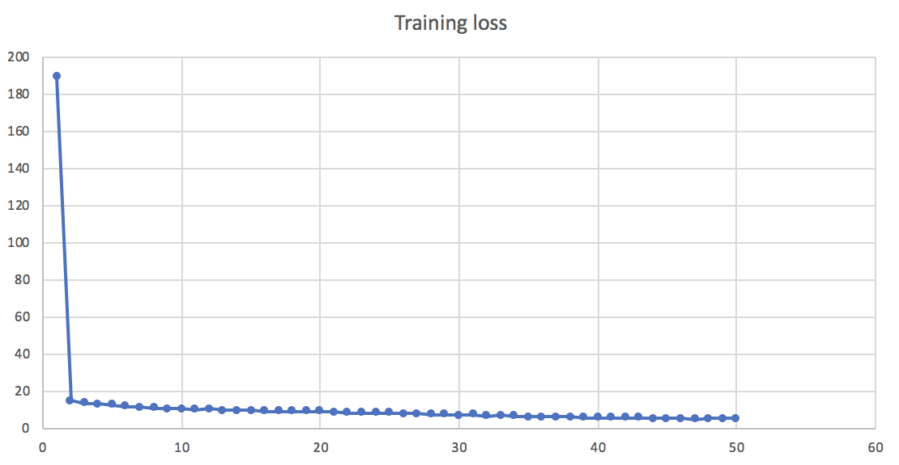
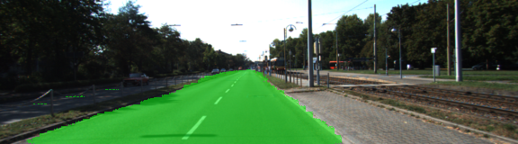
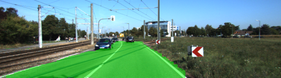
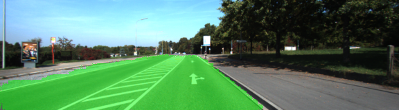
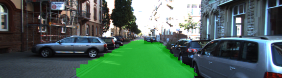
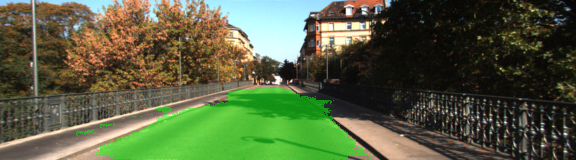

# Semantic Segmentation

### Introduction
Label the pixels of a road in images using a Fully Convolutional Network (FCN).

### Setup

##### GPU

`main.py` will check to make sure you are using GPU - if you don't have a GPU on your system, you can use AWS or another cloud computing platform.

##### Frameworks and Packages

 - [Python 3](https://www.python.org/)
 - [TensorFlow](https://www.tensorflow.org/)
 - [NumPy](http://www.numpy.org/)
 - [SciPy](https://www.scipy.org/)
 - [imgaug](https://imgaug.readthedocs.io/en/latest/)

#### AWS (optional)

The model was trained and tested on [AWS Deep Learning AMI](https://aws.amazon.com/machine-learning/amis/) which has Python3, Tensorflow and other packages pre-installed.

##### Dataset

Download the [Kitti Road dataset](http://www.cvlibs.net/datasets/kitti/eval_road.php) from [here](http://www.cvlibs.net/download.php?file=data_road.zip).  Extract the dataset in the `data` folder.  This will create the folder `data_road` with all the training a test images.

### Run

Start training and generate test images:

```
python main.py --train
```

Additional options:

* `--restore CHECKPOINT_PREFIX` - restore the model from a checkpoint
* `--video INPUT_VIDEO_FILE` - instead of test images, generate a video

### Hyperparameters

* number of classes: 2
* epochs: 50
* batch size: 16
* dropout: 0.5
* learning rate: 0.001

### Data augmentation

Training data augmentation is done using awesome [imgaug](https://imgaug.readthedocs.io/en/latest/) package (see `gen_batch_function` in `helper.py`).

Augmentation techniques used (applied randomly):

* changing hue in HSV colorspace
* contrast normalization
* multiplication (including per-channel multiplication)
* average blur or sharpening
* gaussian noise
* drop pixels
* flipping image horizontally (affects label)
* per-axis scaling (affects label)
* rotation (affects label)
* shear (affects label)
* per-axis translate (affects label)

### Training



### Result







### Addendum: video.

[Link to the video](images/video.mp4)

I tried to apply the model on a recorded GTA5 gameplay video. The result isn't great, unfortunatelly. The video has different camera position and angle,
different environmental colors, different pavement texture - all those things give the model a hard time trying to detect the road pixels.
It detects some pixels though, an almost none false positives. Worth to mention it was even worse without data augmentation - almost no pixels were detected.
Heavier data augmentation or more aggressive dropouts might solve this problem.
